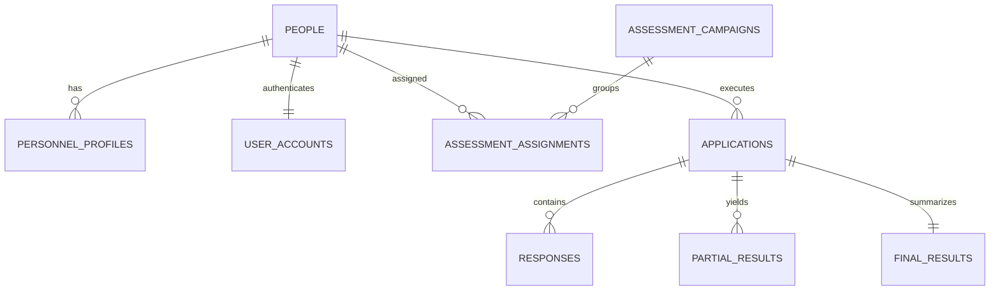
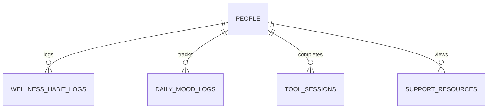

# DATABASE MAP — MENTE DE ACERO V2

**Document Version:** 2.0.0  
**Storage Drivers Supported:** PostgreSQL (Supabase) + Local JSON Fallback (`data/instrument_store.json`)

---

## 1. Existing Production Tables (Preserved 100% Intact)

### 1.1 `people`
- `id` (text, PK)
- `created_at` (timestamptz)
- `id_number` (text, unique) — National ID / Cédula
- `full_name` (text)
- `age` (text/integer)
- `gender` (text)
- `career` (text)
- `email` (text, nullable)
- `google_id` (text, nullable)
- `picture` (text, nullable)

### 1.2 `personnel_profiles`
- `person_id` (text, PK, FK $\to$ `people.id`)
- `unit_code` (text)
- `rank_code` (text)
- `promotion` (integer)
- `specialty_code` (text)
- `description` (text)
- `sex` (text)
- `classification` (text)
- `source` (text)
- `source_updated_at` (timestamptz)
- `created_at` (timestamptz)
- `updated_at` (timestamptz)

### 1.3 `user_accounts`
- `id` (text, PK)
- `person_id` (text, unique, FK $\to$ `people.id`)
- `username` (text, unique)
- `password_hash` (text)
- `password_salt` (text)
- `password_algorithm` (text, default `'scrypt-v1'`)
- `role` (text, check: `'participant'`, `'admin'`)
- `active` (boolean, default `true`)
- `must_change_password` (boolean, default `true`)
- `failed_login_attempts` (integer, default `0`)
- `locked_until` (timestamptz, nullable)
- `last_login_at` (timestamptz, nullable)
- `password_changed_at` (timestamptz, nullable)
- `token_version` (integer, default `0`)
- `created_at` (timestamptz)
- `updated_at` (timestamptz)

### 1.4 `assessment_campaigns`
- `id` (text, PK)
- `code` (text, unique)
- `name` (text)
- `description` (text)
- `active` (boolean)
- `starts_at` (timestamptz)
- `ends_at` (timestamptz)
- `created_at` (timestamptz)
- `updated_at` (timestamptz)

### 1.5 `assessment_assignments`
- `id` (text, PK)
- `campaign_id` (text, FK $\to$ `assessment_campaigns.id`)
- `person_id` (text, FK $\to$ `people.id`)
- `instrument_code` (text, check: `'ema'`, `'baron'`, `'disc'`)
- `required` (boolean, default `true`)
- `assigned_at` (timestamptz)
- `completed_at` (timestamptz, nullable)
- `status` (text, check: `'pending'`, `'in_progress'`, `'completed'`)
- `created_at` (timestamptz)
- `updated_at` (timestamptz)

### 1.6 `applications`
- `id` (text, PK)
- `created_at` (timestamptz)
- `person_id` (text, FK $\to$ `people.id`)
- `instrument_code` (text)
- `instrument_name` (text)
- `instrument_version` (text)
- `status` (text, `'pending'`, `'in_progress'`, `'completed'`, `'invalid'`)
- `current_module_key` (text)
- `percentage_complete` (numeric)
- `valid` (boolean, nullable)
- `started_at` (timestamptz)
- `completed_at` (timestamptz, nullable)
- `participant_snapshot` (jsonb)
- `scoring_snapshot` (jsonb)

### 1.7 `responses`
- `id` (text, PK)
- `created_at` (timestamptz)
- `application_id` (text, FK $\to$ `applications.id`)
- `item_id` (integer)
- `response` (integer)
- `adjusted_response` (integer, nullable)
- `module_key` (text)
- `component_key` (text)
- `subcomponent_keys` (jsonb)

### 1.8 `partial_results`
- `id` (text, PK)
- `created_at` (timestamptz)
- `application_id` (text, FK $\to$ `applications.id`)
- `scope_type` (text, `'module'`, `'component'`, `'subcomponent'`, `'dimension'`)
- `scope_key` (text)
- `scope_label` (text)
- `raw_score` (numeric)
- `normalized_score` (numeric)
- `category` (text)
- `completion_ratio` (numeric)
- `detail_json` (jsonb)

### 1.9 `final_results`
- `id` (text, PK)
- `created_at` (timestamptz)
- `application_id` (text, unique, FK $\to$ `applications.id`)
- `total_raw` (numeric)
- `total_normalized` (numeric)
- `profile_global` (text)
- `valid` (boolean)
- `interpretation_json` (jsonb)
- `detail_json` (jsonb)

---

## 2. Proposed Non-Destructive Extension Tables (Phase 8)

*These tables will be introduced in Migration `008_wellness_and_tools.sql` only after Stop Gate C approval.*

### 2.1 `wellness_habit_logs`
- `id` (text, PK)
- `person_id` (text, FK $\to$ `people.id`)
- `logged_date` (date, default `current_date`)
- `habit_key` (text, check: `'sleep'`, `'water'`, `'movement'`, `'breathing'`, `'journal'`, `'nutrition'`, `'stress_mgmt'`)
- `completed` (boolean, default `false`)
- `numeric_value` (numeric, nullable) — e.g. $7.5$ hours of sleep, $2.0$ liters of water
- `created_at` (timestamptz)
- *Constraint:* Unique `(person_id, logged_date, habit_key)`

### 2.2 `daily_mood_logs`
- `id` (text, PK)
- `person_id` (text, FK $\to$ `people.id`)
- `logged_date` (date, default `current_date`)
- `valence_level` (integer, check: `1..3`) — 1: Bajo, 2: Neutro, 3: Positivo
- `energy_level` (integer, check: `1..5`, nullable)
- `notes` (text, nullable)
- `created_at` (timestamptz)
- *Constraint:* Unique `(person_id, logged_date)`

### 2.3 `tool_sessions`
- `id` (text, PK)
- `person_id` (text, FK $\to$ `people.id`)
- `tool_type` (text, check: `'breathing_478'`, `'cognitive_journal'`, `'mindfulness_pause'`, `'anxiety_first_aid'`)
- `duration_seconds` (integer, default `300`)
- `pre_stress_rating` (integer, check: `1..10`, nullable)
- `post_stress_rating` (integer, check: `1..10`, nullable)
- `notes` (text, nullable)
- `created_at` (timestamptz)

### 2.4 `support_resources`
- `id` (text, PK)
- `organization_name` (text)
- `category` (text) — e.g. `'crisis_line'`, `'institutional_psychology'`, `'chaplaincy'`
- `phone_number` (text)
- `available_hours` (text) — e.g. `'24/7'`, `'Lun-Vie 08:00-17:00'`
- `country_code` (text, default `'CO'`)
- `url` (text, nullable)
- `active` (boolean, default `true`)
- `order_index` (integer, default `0`)
- `created_at` (timestamptz)
