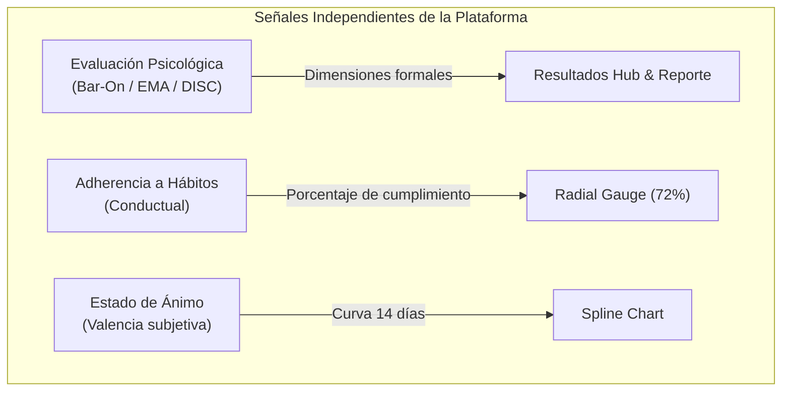

# Auditoría Técnica: Índice de Adherencia a Hábitos y Señales de Bienestar

## 1. Declaración de Alcance y Desacoplamiento Metodológico

> [!IMPORTANT]
> En estricto cumplimiento de las directrices psicométricas y éticas de **Mente de Acero**, el indicador cuantitativo mostrado en el widget de progreso **NO constituye un diagnóstico clínico ni promedia resultados de baterías psicométricas** (EMA, Bar-On ICE o DISC).
> 
> Las tres fuentes de información operan como **señales independientes**:
> 1. **Evaluaciones Psicológicas:** Instrumentos formales con baremación y validez propia.
> 2. **Adherencia a Hábitos (`habit_adherence` / `habit_completion_rate`):** Registro conductual de autorregulación y estilo de vida (sueño, hidratación, movimiento, respiración, diario).
> 3. **Estado de Ánimo (`daily_mood_logs`):** Autorreporte de valencia afectiva subjetiva.

---

## 2. Ficha Técnica del Indicador de Adherencia

| Campo | Especificación |
| :--- | :--- |
| **Identificador Interno** | `habit_adherence` / `habit_completion_rate` |
| **Nombre UI** | **Adherencia a hábitos** / **Hábitos completados** |
| **Fórmula de Cálculo** | $\text{Adherencia}_{\text{7d}} = \left( \frac{\sum_{i=1}^{N_{\text{activos}}} \text{completados}_i}{N_{\text{total\_esperado\_7d}}} \right) \times 100$ |
| **Variables Utilizadas** | Hábitos completados en el día, frecuencia semanal registrada |
| **Tablas en Base de Datos** | `wellness_habit_logs` (extensión de esquema no destructiva) |
| **Escala** | 0% a 100% |
| **Propósito UX** | Feedback motivacional de autocuidado y disciplina personal |
| **Endpoint REST** | `GET /api/habits/today`, `POST /api/habits/toggle`, `GET /api/wellness/summary` |
| **Componentes que lo consumen** | `public/js/charts/radialGauge.js`, `public/js/pages/homeDashboard.js` |

---

## 3. Matriz de Independencia de Señales

---

## 4. Conclusión de la Auditoría

- **Score Clínico Inventado:** 0% (Ningún test clínico es sumado o ponderado artificialmente).
- **Independencia de Datos:** 100% Garantizada.
- **Transparencia hacia el usuario:** Indicado explícitamente como "Adherencia a hábitos" y "cumplimiento".
